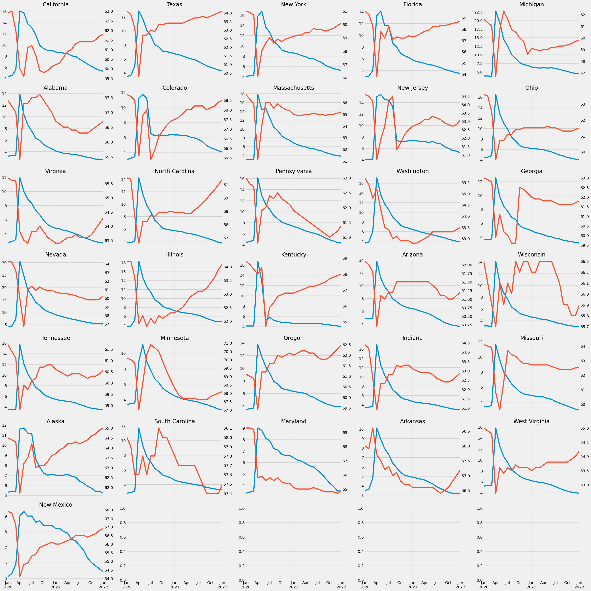

# 📊 Project: Economic Data Analysis from FRED

### 🔗 Source: [YouTube Tutorial by Rob Mulla](https://www.youtube.com/watch?v=R67XuYc9NQ4)

---

## 📌 Overview
This was my **first data analysis project**, built by following a YouTube tutorial.
The goal was to pull economic data directly from the **FRED API** and perform an **Exploratory Data Analysis (EDA)** using Python.

---

## 🛠️ Tools & Libraries
- **Python**
- **Pandas** – data wrangling & manipulation
- **Matplotlib** – static visualizations
- **Plotly** – interactive dashboards & plots
- **FRED API** – fetching real-world economic datasets

---

## 🎯 What I Learned
- Pulled live **economic data** from the FRED API using `Fred` agent.
- Built **interactive visualizations** with Plotly (first-time experience → huge potential for web apps).
- Learned how to **merge data horizontally** (rare but powerful trick).
- Combined **multiple series** in one plot (e.g., Unemployment Rate vs Participation Rate).
- Discovered how to create **multi-plot layouts** (e.g., 30+ charts in one output).
- Realized this project leaned more on the **programming side** than pure analytics → sharpened coding muscles.

---

## 📊 Example Output

*Figure: Each state’s unemployment rate vs participation rate.*

## 🚀 Key Takeaways
- Gained hands-on experience working with **real-world economic data**.
- Improved my **data visualization** skills (both static and interactive).
- Strengthened **Python + API integration** workflow knowledge.
- Built confidence in handling **multi-variable economic analysis**.

---

## 👨‍🏫 Instructor Credit
**Rob Mulla** – YouTube Data Science Educator
