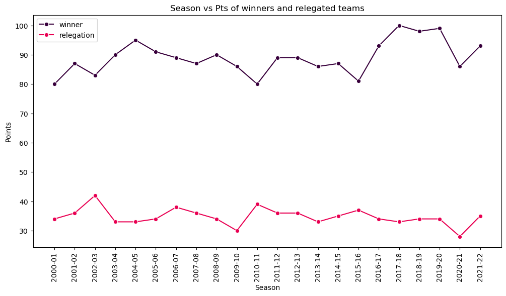
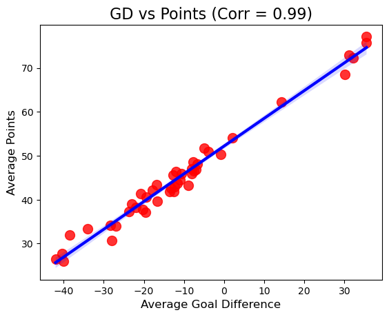
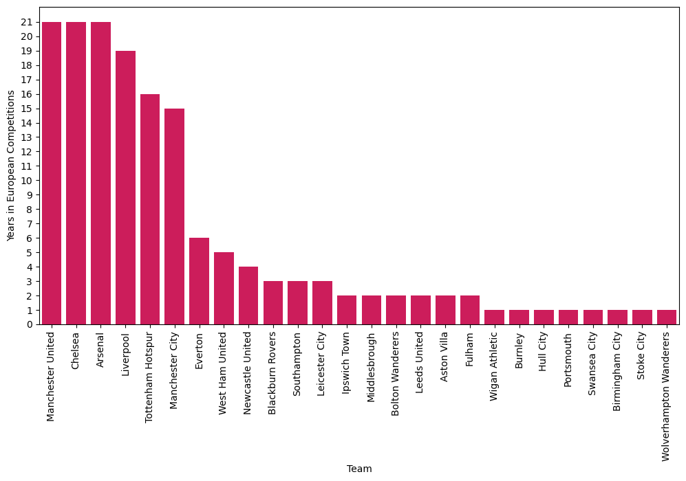

# ⚽ Project: Exploratory Data Analysis on English Premier League (EPL) Data

### 🔗 Source: [DataCamp Code Along – EPL Exploratory Data Analysis](https://datacamp-1.wistia.com/medias/y16ejpjh1d?wtime=5)
👨‍🏫 Instructor: DataCamp Team

---

## 📌 Overview
In this project, I performed an **Exploratory Data Analysis (EDA)** on **English Premier League (EPL)** football data (2000–2022).
The analysis focused on **qualification thresholds**, **relegation battles**, and the relationship between **points (Pts)** and **goal difference (GD)**.

The project demonstrated how **statistical exploration + visualization** can reveal insights into football trends over two decades.

---

## 🛠️ Tools & Libraries
- **Python**
- **Pandas** – data wrangling & analysis
- **Seaborn / Matplotlib** – data visualization
- **Jupyter Notebook** – interactive exploration

---

## 🎯 Key Tasks
1. **Import & clean EPL dataset**
2. Simplify the **Qualification** column for clarity
3. Group teams by **Champions League qualification**
4. Repeat grouping for **Europa League qualification**
5. Plot **time series (2000–2022)** of EPL winners & relegated teams
6. Create **bar charts** of European participation per team
7. Analyze the link between **Goal Difference (GD) and Points (Pts)**
8. Explore wider correlations between GD & Pts (bonus homework)

---

## 📊 Key Insights

### 🔹 Qualification Thresholds
- ~70+ points usually guarantees **Champions League**, but with exceptions.
- ~55 points is typically enough for **Europa League**.
- GD alone is a **weak predictor** of qualification (too much variance).
- Rare cases:
  - Only **3 teams** qualified for UCL below 4th place.
  - Only **1 team** qualified with **<60 Pts** (and even with a **negative GD**).
  - Some teams qualified for **Europa League and got relegated in the same season**.

---

### 🔹 Title vs Relegation Thresholds (2000–2022)
- Weak **negative correlation (-0.3)** between points needed to win the league vs to avoid relegation.
  - When top teams dominate, fewer points are needed to survive relegation.
- Consistent **54-point gap** between winners and relegated teams.
- **No team** has won the league with <80 points since 2000.
- Relegation survival is stable around **35 points**, despite rising title-winning thresholds.

---

### 🔹 Chelsea Case Study (2015–16)
- Only once (2015–16) Chelsea failed to qualify for Europe → bounced back to **win the Premier League next season**.
- Example of how **outliers** can reveal valuable football stories.

---

### 🔹 Goal Difference vs Points
- Strong positive correlation across 21 seasons.
- **Correlation coefficient = 0.99** → GD is a **near-perfect predictor** of points.
- Confirms that **defensive + offensive balance** directly drives long-term success.

---

## 📈 Visualizations
*(Screenshots from the notebook)*

- 📊 Time series of EPL winners vs relegation points (2000–2022)

- 📉 Scatterplot: Goal Difference vs Points (tight correlation, r = 0.99)

- 📊 Bar chart: European participation years per EPL team

---

## 🚀 Key Skills Demonstrated
- Exploratory Data Analysis (EDA)
- Data cleaning & transformation
- Football data storytelling (business-style insights with sports context)
- Correlation analysis (Pts ↔ GD)
- Time-series + comparative visualization

---

## 📌 Conclusion
This project highlighted how **EDA techniques** can be applied to **sports analytics**:

- Revealed qualification thresholds for European competitions
- Quantified the **gap between champions & relegated teams**
- Demonstrated that **Goal Difference almost perfectly predicts Points**
- Showed how **outliers tell stories** (e.g., Chelsea’s 2015–16 collapse and rebound)

⚡ This project proves the power of combining **Python, Pandas, and visualization** to turn raw sports data into **actionable insights** – skills transferable to **business analytics, finance, and beyond**.
